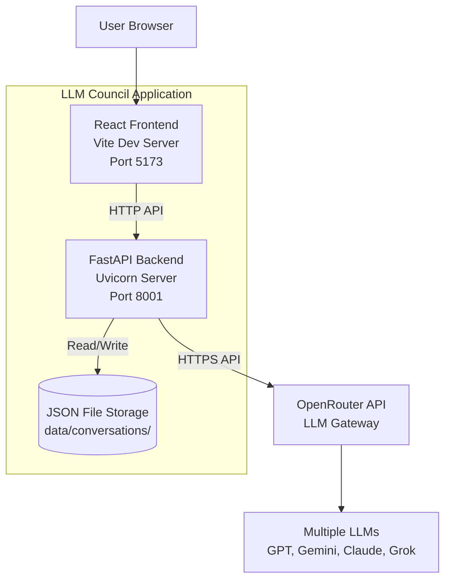
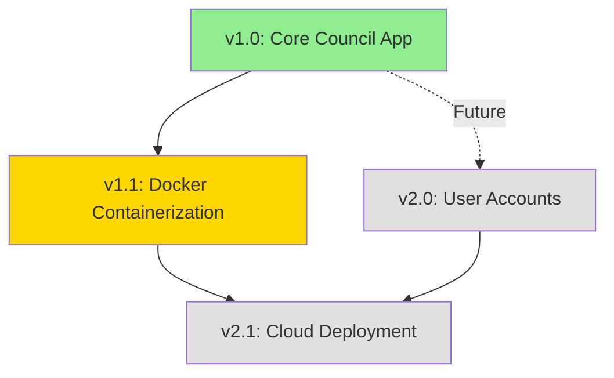

# LLM Council: Product Overview

**Last Updated:** December 24, 2025  
**Current Version:** v1.1.0 (in development)  
**Initial Release:** v1.0.0 (October 15, 2025)

---

## Executive Summary

LLM Council is a local web application that enables users to query multiple Large Language Models (LLMs) simultaneously and receive synthesized insights through a three-stage deliberation process. Instead of relying on a single AI model, users benefit from diverse perspectives, peer review, and chairman-synthesized responses.

**Key Innovation:** Multi-stage council deliberation with anonymized peer review, providing richer and more balanced AI-generated insights.

**Status:** Production-ready for local development use. Containerization in progress for v1.1.

---

## Product Capabilities

### Core Council Functionality [v1.0] ✅

**Description:** Three-stage LLM deliberation process for enhanced query responses

**Detailed Requirements:** [PRD v1.0](./versions/v1.0/PRD-v1.0.md)

**Key Features:**
- **[v1.0-FR-1]** Three-stage council processing
  - **[v1.0-FR-1.1]** Stage 1: Individual LLM responses with tab navigation
  - **[v1.0-FR-1.2]** Stage 2: Anonymized cross-review and ranking
  - **[v1.0-FR-1.3]** Stage 3: Chairman synthesis of final answer

- **[v1.0-FR-2]** Conversation management
  - **[v1.0-FR-2.1]** Create new conversations
  - **[v1.0-FR-2.2]** View conversation history in sidebar
  - **[v1.0-FR-2.3]** Continue existing conversations

- **[v1.0-FR-3]** Council configuration
  - **[v1.0-FR-3.1]** Configure council member LLMs
  - **[v1.0-FR-3.2]** Configure chairman model

- **[v1.0-FR-4]** User interface
  - **[v1.0-FR-4.1]** Query input with submission
  - **[v1.0-FR-4.2]** Stage navigation (tabs/buttons)
  - **[v1.0-FR-4.3]** Markdown response rendering

**User Impact:** Users get multi-perspective AI insights with quality assurance through peer review and synthesis

**Release Date:** October 15, 2025

**Status:** ✅ Shipped and Verified

---

### Development Environment [v1.1] 🚧

**Description:** Docker-based containerization for simplified development setup

**Detailed Requirements:** [PRD v1.1](./versions/v1.1/PRD-v1.1.md)

**Key Features:**
- **[v1.1-FR-1]** Backend Docker container
- **[v1.1-FR-2]** Frontend Docker container
- **[v1.1-FR-3]** Docker Compose orchestration
- **[v1.1-NFR-1]** Hot reload performance < 2 seconds

**User Impact:** Developers can run the application without installing Python or Node.js locally

**Dependencies:** Builds on [v1.0-FR-1] through [v1.0-FR-4] (all core functionality)

**Conflicts Checked:** ✅ No conflicts - containerization is additive and preserves all v1.0 functionality

**Target Release:** December 31, 2025

**Status:** 🚧 In Development

---

## Technical Architecture

### System Overview



### Technology Stack

| Component | Technology | Version | Introduced | Purpose |
|-----------|-----------|---------|------------|---------|
| **Backend Framework** | FastAPI | 0.115+ | v1.0 | REST API server |
| **Backend Runtime** | Python | 3.10+ | v1.0 | Language runtime |
| **ASGI Server** | Uvicorn | 0.32+ | v1.0 | Production server |
| **HTTP Client** | httpx | 0.27+ | v1.0 | Async API calls |
| **Environment Config** | python-dotenv | 1.0+ | v1.0 | .env file loading |
| **Package Manager** | uv | Latest | v1.0 | Python dependency management |
| **Frontend Framework** | React | 19.2 | v1.0 | UI library |
| **Build Tool** | Vite | 7.2 | v1.0 | Dev server & bundler |
| **Markdown Renderer** | react-markdown | 10.1 | v1.0 | Response formatting |
| **Node Runtime** | Node.js | 20 LTS | v1.0 | JavaScript runtime |
| **Containerization** | Docker | 24+ | v1.1 | Container runtime |
| **Container Orchestration** | Docker Compose | v2+ | v1.1 | Multi-container management |
| **macOS Container Runtime** | OrbStack | Latest | v1.1 | Optimized Docker for macOS |

### Data Architecture

**Storage:** JSON file-based persistence

**Location:** `data/conversations/`

**Format:** Each conversation stored as `{uuid}.json`

**Schema:**
```json
{
  "id": "uuid",
  "created_at": "ISO8601 timestamp",
  "messages": [
    {
      "role": "user" | "assistant",
      "content": "string",
      "stages": {
        "stage1": { "responses": {...} },
        "stage2": { "reviews": {...} },
        "stage3": { "synthesis": "..." }
      }
    }
  ]
}
```

**Introduced:** v1.0  
**Modifications:** None (stable schema)

### API Architecture

**Backend API Endpoints:**
- `POST /council/query` - Submit query to council
- `GET /conversations` - List all conversations
- `GET /conversations/{id}` - Get specific conversation
- `POST /conversations/{id}/query` - Continue conversation
- `GET /health` - Health check (added v1.1)

**External APIs:**
- **OpenRouter API** (`https://openrouter.ai/api/v1/chat/completions`)
  - Purpose: LLM gateway for multi-model access
  - Authentication: API key via `Authorization` header
  - Rate Limits: Per user's OpenRouter plan
  - Introduced: v1.0

### Network Architecture

**v1.0 (Native):**
- Backend: `localhost:8001`
- Frontend: `localhost:5173`
- Direct host networking

**v1.1 (Containerized):**
- Backend container: Exposes `8001 → 8001`
- Frontend container: Exposes `5173 → 5173`
- Bridge network: `llm-council-network`
- Containers communicate via service names
- Browser still uses `localhost` URLs

---

## Feature Dependencies



**Legend:**
- 🟢 Green: Shipped
- 🟡 Yellow: In Progress
- ⚪ Gray: Planned

**Dependencies:**
- v1.1 requires v1.0 (all core features)
- v2.1 requires v1.1 (containerization) and v2.0 (multi-user)

---

## Known Constraints & Limitations

### v1.0 Limitations

- ❌ No user authentication (single-user local app)
- ❌ No response caching (each query costs API credits)
- ❌ No conversation search or filtering
- ❌ No export functionality (PDF, Markdown)
- ❌ Requires Python 3.10+ and Node.js installed locally
- ❌ No mobile responsive design
- ❌ Manual model configuration via code editing

### v1.1 Constraints

- ⚠️ Docker/OrbStack required for containerized workflow
- ⚠️ OrbStack optimized for macOS (Docker Desktop works but slower)
- ⚠️ Development containers only (no production optimization)
- ⚠️ Volume mounts require compatible file systems

### System Constraints

- **OpenRouter Dependency:** Requires active OpenRouter account with credits
- **Internet Required:** LLM API calls need internet connectivity
- **API Costs:** Each query incurs OpenRouter costs based on models used
- **Rate Limits:** Subject to OpenRouter rate limiting

---

## Configuration

### Environment Variables

**Required:**
```bash
OPENROUTER_API_KEY=sk-or-v1-xxxxxxxxxxxxx
```

**Optional (v1.1):**
```bash
VITE_API_URL=http://localhost:8001  # Frontend API endpoint
NODE_ENV=development                 # Node environment
PYTHONUNBUFFERED=1                   # Python output buffering
```

### Council Configuration

**File:** `backend/config.py`

**Default Council Members:**
```python
COUNCIL_MODELS = [
    "openai/gpt-5.1",
    "google/gemini-3-pro-preview",
    "anthropic/claude-sonnet-4.5",
    "x-ai/grok-4",
]
```

**Default Chairman:**
```python
CHAIRMAN_MODEL = "google/gemini-3-pro-preview"
```

**Customization:** Users can edit config file to use any OpenRouter-supported models

---

## Conflict Checks (LLM-Assisted)

### Last Comprehensive Check: December 24, 2025

**v1.1 Additions Analysis:**

✅ **Port Conflicts:** None
- Backend remains on 8001
- Frontend remains on 5173
- No new ports introduced

✅ **Data Model Compatibility:** Maintained
- JSON storage format unchanged
- File paths preserved (`data/conversations/`)
- No schema modifications

✅ **API Compatibility:** Maintained
- All v1.0 endpoints preserved
- Added `/health` endpoint (non-breaking)
- Request/response formats unchanged

✅ **Environment Variables:** Backward Compatible
- `OPENROUTER_API_KEY` still required and works same way
- New variables (`VITE_API_URL`, etc.) only used in Docker
- Native setup unaffected

✅ **Configuration:** Backward Compatible
- `backend/config.py` format unchanged
- Same model configuration mechanism
- No breaking changes to config

✅ **Dependencies:** No Conflicts
- Docker dependencies separate from native
- Volume mounts preserve existing file structure
- Native workflow still fully functional

**Potential Issues Identified:** None

**Action Items:** None - v1.1 is fully additive

---

## Version History

| Version | Release Date | Focus | Status | PRD |
|---------|-------------|-------|--------|-----|
| v1.0.0 | 2025-10-15 | Core council functionality | ✅ Shipped | [PRD](./versions/v1.0/PRD-v1.0.md) |
| v1.1.0 | 2025-12-31 (planned) | Docker containerization | 🚧 In Progress | [PRD](./versions/v1.1/PRD-v1.1.md) |
| v2.0.0 | TBD | User accounts & authentication | ⚪ Planned | [PRD](./versions/v2.0/PRD-v2.0.md) |

---

## Roadmap

### v1.1 (Current Sprint) 🚧

**Focus:** Developer Experience

**Timeline:** December 2025

**Goals:**
- Simplify development setup with Docker
- Eliminate Python/Node.js installation requirement
- Maintain hot reload functionality
- Keep backward compatibility with native setup

**Status:** Documentation complete, implementation in progress

### v2.0 (Planned) ⚪

**Focus:** Multi-User Support

**Potential Features:**
- User authentication and accounts
- Per-user conversation storage
- User preferences (default models, chairman)
- Conversation sharing

**Status:** Requirements gathering

### v2.1 (Planned) ⚪

**Focus:** Cloud Deployment

**Potential Features:**
- Production-ready Docker images
- Cloud platform deployment guides
- Scalability improvements
- Database migration from JSON

**Status:** Concept

### Future Ideas 💡

- Response caching to reduce API costs
- Conversation search and filtering
- Export to PDF/Markdown
- Mobile-responsive design
- Custom prompt templates
- Streaming responses
- Model usage analytics

---

## Success Metrics

### v1.0 Metrics (Achieved)

✅ Three-stage council process functional  
✅ 4 LLMs integrated (GPT, Gemini, Claude, Grok)  
✅ Conversation persistence reliable  
✅ Tab-based UI intuitive  
✅ Markdown rendering complete  
✅ Local deployment working  

### v1.1 Target Metrics (In Progress)

🎯 Setup time < 10 minutes for new developer  
🎯 Hot reload < 2 seconds  
🎯 Zero container crashes during normal operation  
🎯 100% backward compatibility with v1.0  

---

## Change Log

| Date | Version Context | Change | Updated By |
|------|-----------------|--------|------------|
| 2025-12-24 | v1.1 planning | Created ProductOverview, added v1.0 baseline, v1.1 in progress | PM Team |
| 2025-10-15 | v1.0 launch | Initial release of core council functionality | PM Team |

---

## Related Documents

### Version-Specific Documentation
- [v1.0 PRD](./versions/v1.0/PRD-v1.0.md) - Core functionality requirements
- [v1.1 PRD](./versions/v1.1/PRD-v1.1.md) - Containerization requirements
- [v1.1 Technical Spec](./versions/v1.1/TechnicalSpec-v1.1.md) - Docker architecture
- [v1.1 Implementation Plan](./versions/v1.1/ImplementationPlan-v1.1.md) - Step-by-step guide

### Project Documentation
- [Project Conventions](./ProjectConventions.md) - Development standards
- [Main README](../README.md) - User-facing documentation

---

**Document Status:** Active  
**Maintained By:** Product Team (with LLM assistance)  
**Next Review:** After v1.1 release

