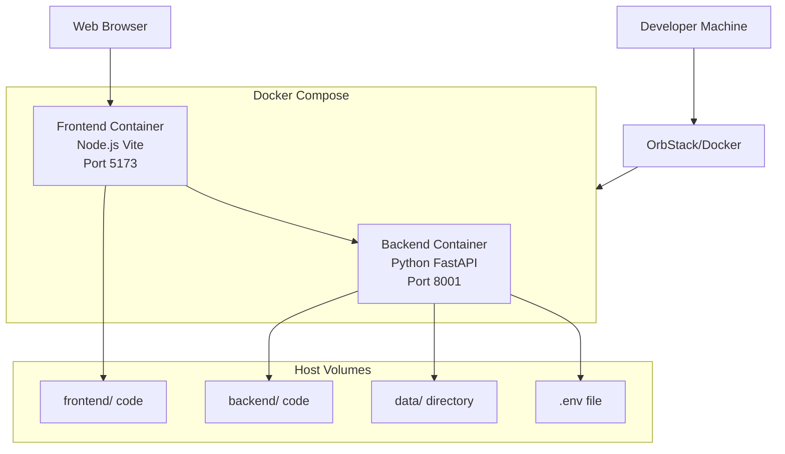
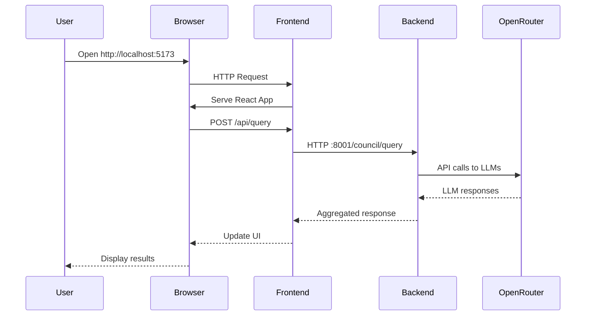

# Technical Specification: LLM Council Containerization

**Version:** 1.0  
**Date:** December 24, 2025  
**Status:** Draft  
**Author:** Development Team

---

## Table of Contents

1. [Architecture Overview](#architecture-overview)
2. [Container Specifications](#container-specifications)
3. [Docker Compose Configuration](#docker-compose-configuration)
4. [Networking & Communication](#networking--communication)
5. [Volume Management](#volume-management)
6. [Environment Configuration](#environment-configuration)
7. [Development Workflow](#development-workflow)
8. [Performance Considerations](#performance-considerations)
9. [Security Considerations](#security-considerations)
10. [Troubleshooting](#troubleshooting)

---

## Architecture Overview

### High-Level Architecture



### Container Communication Flow



### Technology Stack

| Layer | Technology | Version | Purpose |
|-------|-----------|---------|---------|
| Container Runtime | OrbStack | Latest | Fast macOS containers |
| Orchestration | Docker Compose | v2.x | Multi-container management |
| Backend Base | Python | 3.11 | Language runtime |
| Backend Framework | FastAPI | 0.115+ | Web framework |
| Backend Server | Uvicorn | 0.32+ | ASGI server |
| Package Manager | uv | Latest | Python dependencies |
| Frontend Base | Node.js | 20 LTS | JavaScript runtime |
| Frontend Framework | React | 19.2 | UI library |
| Build Tool | Vite | 7.2 | Development server & bundler |

---

## Container Specifications

### Backend Container

**Base Image:** `python:3.11-slim`

**Rationale:**
- Slim variant balances size (~120MB) with compatibility
- Python 3.11 provides good performance and modern features
- Official Python images are well-maintained and secure

**Dockerfile Location:** `backend.Dockerfile`

**Key Build Steps:**
```dockerfile
1. Install system dependencies (curl for healthcheck)
2. Install uv package manager
3. Copy pyproject.toml and uv.lock
4. Run uv sync to install Python dependencies
5. Set working directory to /app
6. Expose port 8001
7. Command: uv run python -m backend.main
```

**Port Mapping:**
- Container: `8001` → Host: `8001`

**Volume Mounts:**
- `./backend:/app/backend` - Backend source code (read-write)
- `./data:/app/data` - Conversation storage (read-write)
- `./.env:/app/.env` - Environment variables (read-only)

**Environment Variables:**
- `PYTHONUNBUFFERED=1` - Force Python output to stdout
- Inherits from `.env` file (OPENROUTER_API_KEY)

**Resource Limits (Development):**
- Memory: No hard limit (use system default)
- CPU: No hard limit (use system default)

**Health Check:**
```yaml
healthcheck:
  test: ["CMD", "curl", "-f", "http://localhost:8001/health"]
  interval: 30s
  timeout: 10s
  retries: 3
  start_period: 40s
```

---

### Frontend Container

**Base Image:** `node:20-alpine`

**Rationale:**
- Alpine variant for smaller image size (~40MB)
- Node 20 LTS for long-term stability
- Alpine includes required build tools

**Dockerfile Location:** `frontend.Dockerfile`

**Key Build Steps:**
```dockerfile
1. Set working directory to /app
2. Copy package.json and package-lock.json
3. Run npm install
4. Copy frontend source code
5. Expose port 5173
6. Command: npm run dev -- --host 0.0.0.0
```

**Port Mapping:**
- Container: `5173` → Host: `5173`

**Volume Mounts:**
- `./frontend:/app` - Frontend source code (read-write)
- `/app/node_modules` - Anonymous volume to preserve container's node_modules

**Environment Variables:**
- `VITE_API_URL=http://localhost:8001` - Backend API URL
- `NODE_ENV=development`

**Vite Configuration:**
- Must use `--host 0.0.0.0` to accept external connections
- HMR (Hot Module Replacement) configured for container networking

**Health Check:**
```yaml
healthcheck:
  test: ["CMD", "wget", "--no-verbose", "--tries=1", "--spider", "http://localhost:5173"]
  interval: 30s
  timeout: 10s
  retries: 3
  start_period: 60s
```

---

## Docker Compose Configuration

### File Location
`docker-compose.yml` at project root

### Service Definitions

```yaml
version: '3.9'

services:
  backend:
    build:
      context: .
      dockerfile: backend.Dockerfile
    container_name: llm-council-backend
    ports:
      - "8001:8001"
    volumes:
      - ./backend:/app/backend
      - ./data:/app/data
      - ./.env:/app/.env:ro
    environment:
      - PYTHONUNBUFFERED=1
    healthcheck:
      test: ["CMD", "curl", "-f", "http://localhost:8001/health"]
      interval: 30s
      timeout: 10s
      retries: 3
      start_period: 40s
    restart: unless-stopped
    networks:
      - llm-council-network

  frontend:
    build:
      context: ./frontend
      dockerfile: frontend.Dockerfile
    container_name: llm-council-frontend
    ports:
      - "5173:5173"
    volumes:
      - ./frontend:/app
      - /app/node_modules
    environment:
      - VITE_API_URL=http://localhost:8001
      - NODE_ENV=development
    depends_on:
      backend:
        condition: service_healthy
    healthcheck:
      test: ["CMD", "wget", "--no-verbose", "--tries=1", "--spider", "http://localhost:5173"]
      interval: 30s
      timeout: 10s
      retries: 3
      start_period: 60s
    restart: unless-stopped
    networks:
      - llm-council-network

networks:
  llm-council-network:
    driver: bridge
```

### Service Dependencies

Frontend depends on Backend:
- Frontend waits for backend health check to pass
- Ensures backend API is ready before frontend starts
- Prevents frontend startup errors

---

## Networking & Communication

### Network Configuration

**Network Type:** Bridge network (default for Compose)

**Network Name:** `llm-council-network`

**Container DNS:**
- Containers can reach each other by service name
- Backend accessible at `http://backend:8001` from frontend container
- Frontend accessible at `http://frontend:5173` from backend container

### Port Forwarding

| Service | Container Port | Host Port | Protocol | Purpose |
|---------|---------------|-----------|----------|---------|
| Backend | 8001 | 8001 | HTTP | FastAPI API endpoints |
| Frontend | 5173 | 5173 | HTTP | Vite dev server + HMR |

### API Communication

**Frontend → Backend:**
- Browser makes requests to `http://localhost:8001` (host networking)
- Not using container DNS because browser runs on host
- CORS configured in FastAPI to accept localhost:5173 origin

**Backend → OpenRouter:**
- Backend makes outbound HTTPS requests to `openrouter.ai`
- No special network configuration needed
- Uses host network's DNS and routing

### Hot Module Replacement (HMR)

**Vite HMR Configuration:**
- Vite dev server must bind to `0.0.0.0` (not `localhost`)
- WebSocket connection from browser to Vite server
- Port 5173 must be accessible from host

**vite.config.js Settings:**
```javascript
export default {
  server: {
    host: '0.0.0.0',
    port: 5173,
    watch: {
      usePolling: false, // OrbStack handles file watching well
    },
    hmr: {
      host: 'localhost',
      port: 5173,
    }
  }
}
```

---

## Volume Management

### Volume Strategy

Using **bind mounts** for development (not Docker volumes):
- Direct mapping of host directories into containers
- Changes on host immediately visible in container
- Supports hot reload without container restart
- No data duplication

### Backend Volumes

| Host Path | Container Path | Mode | Purpose |
|-----------|---------------|------|---------|
| `./backend` | `/app/backend` | rw | Python source code |
| `./data` | `/app/data` | rw | Conversation JSON files |
| `./.env` | `/app/.env` | ro | API key and config |

**Important Notes:**
- `.env` mounted read-only for safety
- `data/` must persist across container lifecycle
- Backend code changes trigger uvicorn auto-reload

### Frontend Volumes

| Host Path | Container Path | Mode | Purpose |
|-----------|---------------|------|---------|
| `./frontend` | `/app` | rw | React source code & config |
| (anonymous) | `/app/node_modules` | rw | Preserve container dependencies |

**Node Modules Strategy:**
- Anonymous volume overlays `/app/node_modules`
- Prevents host `node_modules` from overwriting container's
- Different architectures (macOS vs Linux) may have incompatible binaries
- Host can still run `npm install` for IDE purposes without conflicts

### Data Persistence

**Conversation Storage:**
- JSON files in `./data/conversations/` persist on host
- Not affected by container lifecycle (stop, restart, rebuild)
- Can be backed up independently of containers

**Environment Configuration:**
- `.env` file on host, read by backend container
- Changes require container restart to take effect
- Keep `.env` out of version control (.gitignore)

---

## Environment Configuration

### Required Environment Variables

**Backend (.env file):**
```bash
OPENROUTER_API_KEY=sk-or-v1-xxxxxxxxxxxxx
```

**Frontend (Docker Compose):**
```bash
VITE_API_URL=http://localhost:8001
NODE_ENV=development
```

### Configuration File Locations

| File | Purpose | Container Path | Host Path |
|------|---------|---------------|-----------|
| `.env` | API keys | `/app/.env` | `./.env` |
| `pyproject.toml` | Python deps | `/app/pyproject.toml` | `./pyproject.toml` |
| `uv.lock` | Python lockfile | `/app/uv.lock` | `./uv.lock` |
| `package.json` | Node deps | `/app/package.json` | `./frontend/package.json` |
| `package-lock.json` | Node lockfile | `/app/package-lock.json` | `./frontend/package-lock.json` |

### Environment Variable Loading

**Backend:**
1. Docker Compose sets `PYTHONUNBUFFERED=1`
2. FastAPI app loads `.env` using `python-dotenv`
3. `backend/config.py` reads `OPENROUTER_API_KEY`

**Frontend:**
1. Docker Compose sets `VITE_API_URL` and `NODE_ENV`
2. Vite exposes variables prefixed with `VITE_` to client code
3. React app accesses via `import.meta.env.VITE_API_URL`

---

## Development Workflow

### Starting the Application

**Option 1: Standard Docker Compose**
```bash
docker compose up
```

**Option 2: Background Mode**
```bash
docker compose up -d
docker compose logs -f
```

**Option 3: Wrapper Script (Optional)**
```bash
./docker-start.sh
```

### Stopping the Application

**Graceful Shutdown:**
```bash
# If running in foreground:
Ctrl+C

# If running in background:
docker compose down
```

**Force Stop:**
```bash
docker compose down --timeout 0
```

### Rebuilding Containers

**When to Rebuild:**
- After changing Dockerfile
- After updating dependencies in `pyproject.toml` or `package.json`
- When base images need updates

**Rebuild Commands:**
```bash
# Rebuild all services
docker compose build

# Rebuild specific service
docker compose build backend

# Rebuild and restart
docker compose up --build
```

### Viewing Logs

**All Services:**
```bash
docker compose logs -f
```

**Specific Service:**
```bash
docker compose logs -f backend
docker compose logs -f frontend
```

**Last N Lines:**
```bash
docker compose logs --tail=100 backend
```

### Development File Changes

**Python Files (backend/):**
1. Edit file on host
2. File change detected by volume mount
3. Uvicorn auto-reloads backend server
4. Changes live in ~1-2 seconds

**React Files (frontend/src/):**
1. Edit file on host
2. File change detected by volume mount
3. Vite HMR updates browser
4. Changes live in ~1-2 seconds (no page refresh)

**Dependency Changes:**

*Python (pyproject.toml):*
```bash
# Edit pyproject.toml
docker compose exec backend uv sync
docker compose restart backend
```

*Node (package.json):*
```bash
# Edit package.json
docker compose exec frontend npm install
docker compose restart frontend
```

### Debugging

**Access Container Shell:**
```bash
# Backend
docker compose exec backend /bin/bash

# Frontend
docker compose exec frontend /bin/sh  # Alpine uses sh
```

**Check Container Status:**
```bash
docker compose ps
docker compose top
```

**Inspect Configuration:**
```bash
docker compose config
```

---

## Performance Considerations

### OrbStack Optimizations

**Why OrbStack?**
- Native macOS file system integration (faster than Docker Desktop)
- VirtioFS provides near-native file I/O performance
- Lower CPU and memory overhead
- Better battery life on MacBooks

**File Watching:**
- OrbStack propagates file system events correctly
- No need for polling-based file watching
- Compatible with Vite and Uvicorn hot reload

### Build Performance

**Layer Caching:**
- Dockerfile layers are cached
- Dependency installation only runs when lockfiles change
- Source code changes don't invalidate dependency layers

**Optimization Strategy:**
```dockerfile
# Copy dependency files first (changes infrequently)
COPY pyproject.toml uv.lock ./
RUN uv sync

# Copy source code last (changes frequently)
COPY backend/ ./backend/
```

### Runtime Performance

**Expected Performance:**
- Startup time: 20-30 seconds (first time)
- Hot reload: 1-2 seconds
- API response time: Same as native (< 5ms overhead)
- Memory usage: ~500MB backend, ~300MB frontend

**Monitoring:**
```bash
# Check resource usage
docker stats

# Profile specific container
docker stats llm-council-backend
```

---

## Security Considerations

### Development Environment

**Current Security Posture:**
- Containers run as root (acceptable for local dev)
- `.env` file mounted as read-only
- No sensitive data in container images
- Ports only exposed to localhost

### Best Practices Applied

1. **Secrets Management:**
   - API key in `.env` file (not hardcoded)
   - `.env` in `.gitignore`
   - `.env` mounted as read-only volume

2. **Network Isolation:**
   - Containers on private bridge network
   - Only necessary ports exposed to host
   - No unnecessary container-to-container communication

3. **Image Security:**
   - Using official base images (python, node)
   - Slim/Alpine variants to reduce attack surface
   - Regular rebuilds to get security updates

### Not Implemented (Future Considerations)

- [ ] Non-root user in containers
- [ ] Secret scanning in CI/CD
- [ ] Image vulnerability scanning
- [ ] Network policies
- [ ] TLS/SSL for container communication

---

## Troubleshooting

### Common Issues & Solutions

#### Issue: Port Already in Use

**Symptom:**
```
Error: bind: address already in use
```

**Solution:**
```bash
# Find process using port
lsof -i :8001
lsof -i :5173

# Kill process or change port in docker-compose.yml
docker compose down
# Change ports: "8002:8001" and "5174:5173"
docker compose up
```

#### Issue: Hot Reload Not Working

**Symptom:** File changes don't trigger reload

**Solution:**
```bash
# Check if volumes are mounted correctly
docker compose exec backend ls -la /app/backend
docker compose exec frontend ls -la /app/src

# OrbStack file watching should work, but can enable polling:
# In vite.config.js:
server: {
  watch: {
    usePolling: true,
    interval: 1000
  }
}
```

#### Issue: API Key Not Loading

**Symptom:** Backend logs show missing API key

**Solution:**
```bash
# Check .env file exists
ls -la .env

# Check .env is mounted in container
docker compose exec backend cat /app/.env

# Verify environment variable
docker compose exec backend printenv OPENROUTER_API_KEY

# Restart container to reload .env
docker compose restart backend
```

#### Issue: Frontend Can't Reach Backend

**Symptom:** API calls fail with connection refused

**Solution:**
```bash
# Check backend health
curl http://localhost:8001/health

# Check backend logs
docker compose logs backend

# Verify frontend environment
docker compose exec frontend printenv VITE_API_URL

# Check network connectivity
docker compose exec frontend wget -O- http://backend:8001/health
```

#### Issue: Slow Container Build

**Symptom:** `docker compose build` takes very long

**Solution:**
```bash
# Check .dockerignore exists and includes:
# node_modules, __pycache__, .git, etc.

# Clear build cache if needed
docker builder prune

# Use BuildKit for faster builds (usually default)
DOCKER_BUILDKIT=1 docker compose build
```

#### Issue: Data Not Persisting

**Symptom:** Conversations lost after restart

**Solution:**
```bash
# Verify volume mount
docker compose exec backend ls -la /app/data/conversations/

# Check permissions
ls -la data/conversations/

# Ensure using correct docker compose commands:
docker compose stop  # (not 'down' which removes containers)
docker compose start
```

---

## Appendix

### File Structure

```
llm-council/
├── backend.Dockerfile          # Backend container definition
├── frontend.Dockerfile         # Frontend container definition  
├── docker-compose.yml          # Multi-container orchestration
├── .dockerignore              # Files to exclude from build
├── .env                       # API keys (gitignored)
├── backend/                   # Python source (mounted)
│   ├── __init__.py
│   ├── config.py
│   ├── council.py
│   ├── main.py
│   ├── openrouter.py
│   └── storage.py
├── frontend/                  # React source (mounted)
│   ├── .dockerignore
│   ├── package.json
│   ├── vite.config.js
│   └── src/
└── data/                      # Persistent data (mounted)
    └── conversations/
```

### Related Documents

- Product Requirements: `PRD.md`
- Implementation Plan: `ImplementationPlan.md`
- Main Documentation: `../README.md`

### References

- [OrbStack Documentation](https://docs.orbstack.dev/)
- [Docker Compose Specification](https://docs.docker.com/compose/compose-file/)
- [Vite Docker Guide](https://vitejs.dev/guide/docker.html)
- [FastAPI Deployment](https://fastapi.tiangolo.com/deployment/docker/)

---

**Document Status:** Ready for Implementation  
**Last Updated:** December 24, 2025  
**Next Review:** After initial implementation

