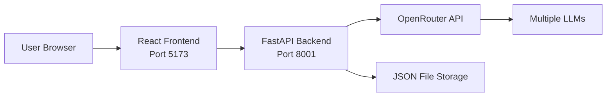

# Product Requirements Document: LLM Council v1.0

**Version:** 1.0  
**Date:** October 15, 2025 (retroactive documentation)  
**Status:** Shipped  
**Author:** Product Team

---

## Executive Summary

LLM Council v1.0 is a local web application that aggregates insights from multiple Large Language Models (LLMs) through a three-stage deliberation process. Instead of querying a single LLM, users get the benefit of multiple AI perspectives, cross-evaluation, and synthesized final responses.

**Core Innovation:** Multi-stage council deliberation with anonymized peer review.

---

## Goals & Motivation

### Primary Goals

1. **Multi-LLM Comparison**
   - Enable side-by-side evaluation of different LLM outputs
   - Compare reasoning approaches across models
   - Identify where models agree and disagree

2. **Enhanced Response Quality**
   - Leverage collective intelligence of multiple models
   - Cross-review reduces individual model biases
   - Chairman synthesis provides balanced final answer

3. **Educational Tool**
   - Learn how different LLMs approach the same problem
   - Understand model strengths and weaknesses
   - Useful for book reading and deep research

### Target Users

- Researchers evaluating LLM capabilities
- Developers comparing model outputs
- Students learning with AI assistance
- Anyone seeking high-quality AI responses

---

## Requirements

### Functional Requirements

#### FR-1: Three-Stage Council Process

The system shall implement a three-stage deliberation process for each query.

##### FR-1.1: Stage 1 - First Opinions

The system shall:
- Send user query to all configured council LLMs simultaneously
- Collect individual responses from each model
- Display responses in a tab view interface
- Allow users to navigate between individual LLM responses
- Show which LLM provided each response

**Priority:** P0 (Must Have)  
**Status:** ✅ Verified

##### FR-1.2: Stage 2 - Cross Review

The system shall:
- Present each LLM with all other models' responses (anonymized)
- Anonymize LLM identities to prevent favoritism
- Ask each LLM to rank responses by accuracy and insight
- Collect rankings from all council members
- Display review and ranking results

**Priority:** P0 (Must Have)  
**Status:** ✅ Verified

##### FR-1.3: Stage 3 - Chairman Synthesis

The system shall:
- Designate one LLM as the Chairman
- Provide Chairman with all responses and reviews
- Request synthesized final answer incorporating all perspectives
- Display final synthesized response to user
- Show how Chairman incorporated different viewpoints

**Priority:** P0 (Must Have)  
**Status:** ✅ Verified

#### FR-2: Conversation Management

##### FR-2.1: Create Conversations

The system shall allow users to:
- Start new conversations with a query
- Each conversation gets a unique identifier
- Conversations stored persistently

**Priority:** P0 (Must Have)  
**Status:** ✅ Verified

##### FR-2.2: View Conversation History

The system shall:
- Display list of past conversations in sidebar
- Show conversation title/preview
- Allow navigation between conversations
- Persist conversations across sessions

**Priority:** P0 (Must Have)  
**Status:** ✅ Verified

##### FR-2.3: Continue Conversations

The system shall:
- Allow follow-up queries in existing conversations
- Maintain conversation context
- Display full conversation history

**Priority:** P1 (Should Have)  
**Status:** ✅ Verified

#### FR-3: Council Configuration

##### FR-3.1: Configure Council Members

The system shall allow configuration of:
- Which LLM models are council members
- Council member list in `backend/config.py`
- Support for any OpenRouter-compatible models

**Default Council:**
- openai/gpt-5.1
- google/gemini-3-pro-preview
- anthropic/claude-sonnet-4.5
- x-ai/grok-4

**Priority:** P0 (Must Have)  
**Status:** ✅ Verified

##### FR-3.2: Configure Chairman Model

The system shall allow configuration of:
- Which LLM serves as Chairman
- Chairman designation in `backend/config.py`
- Chairman can be same or different from council members

**Default Chairman:** google/gemini-3-pro-preview

**Priority:** P0 (Must Have)  
**Status:** ✅ Verified

#### FR-4: User Interface

##### FR-4.1: Query Input

The system shall provide:
- Text input field for user queries
- Submit button to send queries
- Clear indication of processing state

**Priority:** P0 (Must Have)  
**Status:** ✅ Verified

##### FR-4.2: Stage Navigation

The system shall provide:
- Tab or button interface to switch between stages
- Visual indication of current stage
- Easy navigation between Stage 1, 2, and 3 views

**Priority:** P0 (Must Have)  
**Status:** ✅ Verified

##### FR-4.3: Response Rendering

The system shall:
- Render markdown-formatted responses
- Support code blocks with syntax highlighting
- Display formatted text (bold, italic, lists)
- Handle links and images in responses

**Priority:** P0 (Must Have)  
**Status:** ✅ Verified

---

### Non-Functional Requirements

#### NFR-1: Performance

##### NFR-1.1: Response Time

The system shall:
- Begin displaying Stage 1 responses within 30 seconds (typical)
- Process all three stages within 2 minutes (typical)
- Show progress indicators during processing

**Note:** Actual timing depends on LLM API response times

**Priority:** P1 (Should Have)  
**Status:** ✅ Verified

#### NFR-2: Reliability

##### NFR-2.1: API Error Handling

The system shall:
- Handle OpenRouter API errors gracefully
- Display meaningful error messages to users
- Continue processing if individual LLM fails
- Log errors for debugging

**Priority:** P0 (Must Have)  
**Status:** ✅ Verified

##### NFR-2.2: Data Persistence

The system shall:
- Reliably persist conversations to disk
- Recover from crashes without data loss
- Store conversations as JSON files

**Priority:** P0 (Must Have)  
**Status:** ✅ Verified

#### NFR-3: Usability

##### NFR-3.1: Setup Simplicity

The system shall:
- Require minimal configuration (just API key)
- Provide clear setup instructions
- Use simple startup script

**Priority:** P1 (Should Have)  
**Status:** ✅ Verified

##### NFR-3.2: Local Operation

The system shall:
- Run entirely on local machine
- Not require cloud deployment
- Work with localhost URLs
- Keep all data local except API calls

**Priority:** P0 (Must Have)  
**Status:** ✅ Verified

#### NFR-4: Maintainability

##### NFR-4.1: Code Simplicity

The system should:
- Use simple, readable code structure
- Minimize dependencies
- Follow "vibe coding" philosophy
- Be easily modifiable by users

**Priority:** P2 (Nice to Have)  
**Status:** ✅ Verified

---

## Technical Architecture Overview

### System Components



### Technology Stack

| Component | Technology | Purpose |
|-----------|-----------|---------|
| Backend | FastAPI (Python 3.10+) | API server |
| Frontend | React 19.2 + Vite 7.2 | User interface |
| Package Manager | uv | Python dependencies |
| HTTP Client | httpx | Async API calls |
| Storage | JSON files | Conversation persistence |
| LLM Gateway | OpenRouter API | Multi-LLM access |
| Markdown Rendering | react-markdown | Response formatting |

---

## User Workflows

### Primary Workflow: Ask a Question

1. User enters query in text field
2. User clicks Submit
3. **Stage 1:** System sends query to all council LLMs
   - User sees individual responses in tabs
   - Can read each LLM's perspective
4. **Stage 2:** System sends responses to all LLMs for review
   - User sees each LLM's rankings and critiques
   - Responses are anonymized
5. **Stage 3:** Chairman synthesizes final answer
   - User sees synthesized response
   - Chairman incorporates multiple viewpoints
6. Conversation saved to history

### Secondary Workflow: Review Past Conversations

1. User opens application
2. Sidebar shows list of past conversations
3. User clicks on a conversation
4. Full conversation history loads
5. User can continue with new query

---

## Dependencies & Constraints

### External Dependencies

- **OpenRouter API** - Required for LLM access
  - User must have API key
  - User must have credits/payment configured
  - Rate limits apply per OpenRouter plan

### Technical Constraints

- **Local Development Only** - v1.0 designed for local use
- **No Authentication** - Single user, no login required
- **No Cloud Storage** - All data stored locally
- **Manual Model Configuration** - Edit config file to change models

---

## Success Metrics (v1.0)

✅ **Achieved:**
- Three-stage council process implemented
- 4 default LLMs configured (GPT, Gemini, Claude, Grok)
- Conversation persistence working
- Tab-based UI for viewing stages
- Markdown rendering functional
- Local deployment successful

---

## Known Limitations (v1.0)

- No user authentication or multi-user support
- No response caching (each query costs API credits)
- No conversation search or filtering
- No export functionality
- Requires Python and Node.js installed locally
- No mobile optimization
- Chairman model hardcoded in config

---

## Future Enhancements (Out of Scope for v1.0)

- User authentication and accounts
- Conversation search and tagging
- Response caching to reduce costs
- Export conversations (PDF, Markdown)
- Mobile-responsive design
- Docker containerization (→ v1.1)
- Cloud deployment support
- Custom prompt templates
- Streaming responses

---

## Appendix

### API Key Setup

Users must obtain an OpenRouter API key:
1. Visit https://openrouter.ai
2. Sign up for account
3. Purchase credits or enable auto-top-up
4. Copy API key
5. Create `.env` file with `OPENROUTER_API_KEY=sk-or-v1-...`

### Data Storage Format

Conversations stored in `data/conversations/{uuid}.json`:

```json
{
  "id": "conversation-uuid",
  "created_at": "2025-10-15T12:00:00Z",
  "messages": [
    {
      "role": "user",
      "content": "What is quantum computing?"
    },
    {
      "role": "assistant",
      "stages": {
        "stage1": { /* individual responses */ },
        "stage2": { /* reviews */ },
        "stage3": { /* final synthesis */ }
      }
    }
  ]
}
```

---

## Related Documents

- [Product Overview](../ProductOverview.md) - System-wide documentation
- [Main README](../../README.md) - User-facing documentation
- [Project Conventions](../ProjectConventions.md) - Development standards

---

**Document Status:** Completed (Retroactive)  
**Release Date:** October 15, 2025  
**Next Version:** v1.1 (Docker Containerization)

