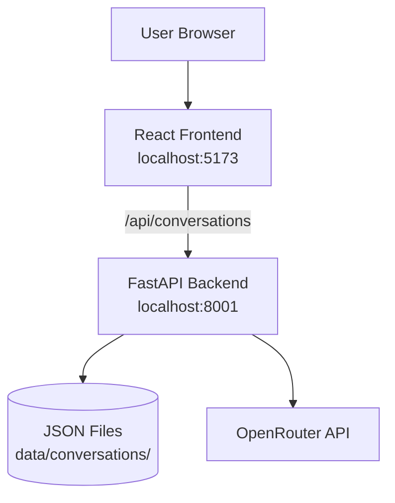
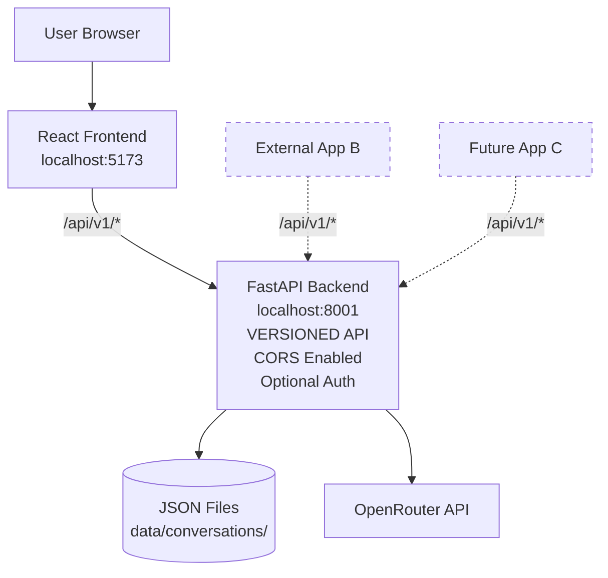
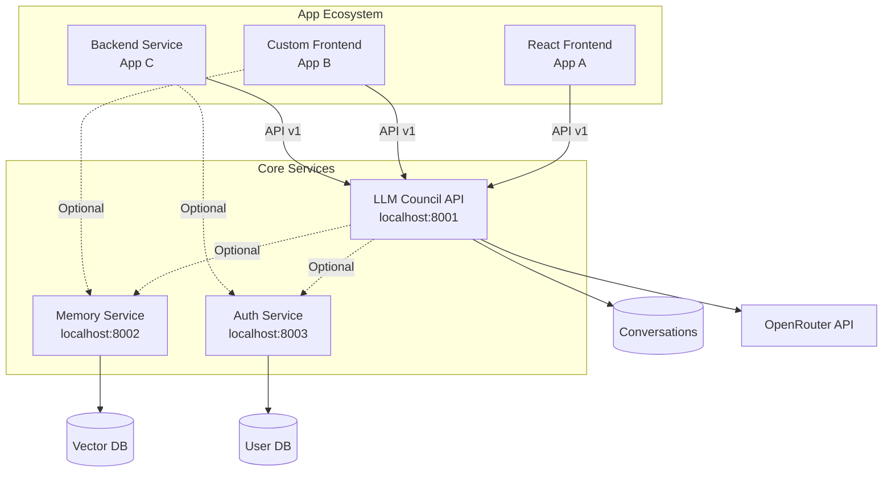

# Product Requirements Document: LLM Council v1.2 - API-Ready Architecture

**Version:** 1.2  
**Date:** December 24, 2025  
**Status:** Draft  
**Owner:** Development Team

---

## Executive Summary

This document outlines the product requirements for making LLM Council API-ready while maintaining its standalone web application functionality. The goal is to enable external applications to integrate with the council's deliberation capabilities, establishing the foundation for a broader app ecosystem without compromising the existing user experience.

**Key Innovation:** Transform LLM Council from a standalone app into a dual-mode system that works both as a self-contained application and as a callable API service.

---

## Goals & Motivation

### Primary Goals

1. **Enable External Integration**
   - Allow other applications (frontends, backends, CLIs) to call LLM Council
   - Provide clean API boundaries for external consumers
   - Maintain stateless API design for scalability

2. **Maintain Standalone Functionality**
   - Existing web UI continues to work without changes
   - No breaking changes to current deployment model
   - Backward compatibility with v1.1 Docker setup

3. **Foundation for App Ecosystem**
   - Establish patterns for multi-app integration
   - Design with future shared services in mind
   - Keep individual apps small and focused

4. **Developer Experience**
   - Clear API documentation for external developers
   - Simple authentication mechanism
   - Easy testing and debugging

### Why Now?

- v1.1 containerization provides stable foundation
- Current API architecture (FastAPI) is already 80% ready
- Next planned app will be first consumer of council API
- Establishing patterns early prevents technical debt

---

## User Stories

### Developer Stories (Primary)

**Story 1: External Frontend Integration**
> As a **developer building a new frontend**,  
> I want to **call the LLM Council API from my application**,  
> So that I can **leverage multi-perspective AI insights without rebuilding the council logic**.

**Acceptance Criteria:**
- API endpoints clearly documented with examples
- Can authenticate requests with API key
- Response format is consistent and well-defined
- CORS configured to accept cross-origin requests

**Story 2: Backend-to-Backend Integration**
> As a **developer building a backend service**,  
> I want to **query the council programmatically**,  
> So that I can **integrate council insights into my application's workflows**.

**Acceptance Criteria:**
- API works from Python/JavaScript/curl
- Authentication via HTTP header
- No browser-specific requirements
- Stateless requests (no session cookies)

**Story 3: Versioned API Stability**
> As an **external application developer**,  
> I want **versioned API endpoints that won't break unexpectedly**,  
> So that I can **build reliable integrations that survive council updates**.

**Acceptance Criteria:**
- All API routes prefixed with `/api/v1/`
- Breaking changes go to `/api/v2/`
- Version documented in responses
- Deprecated endpoints announced in advance

### User Stories (Secondary)

**Story 4: Existing UI Unchanged**
> As an **existing LLM Council user**,  
> I want the **web interface to continue working exactly as before**,  
> So that **my workflow is not disrupted by these changes**.

**Acceptance Criteria:**
- All existing features work identically
- No new login/auth required for standalone use
- Same port numbers and URLs
- No performance degradation

---

## Requirements Traceability Matrix

| User Story | Functional Requirements | Non-Functional Requirements | Notes |
|------------|------------------------|----------------------------|-------|
| Story 1: External Frontend | FR-1.1, FR-1.2, FR-1.3, FR-2.1 | NFR-1.1, NFR-2.1 | Enable cross-origin calls |
| Story 2: Backend Integration | FR-1.1, FR-1.2, FR-2.1, FR-3.1 | NFR-1.2, NFR-2.1 | Stateless API design |
| Story 3: Versioned Stability | FR-2.1, FR-2.2, FR-2.3 | NFR-1.3, NFR-2.2 | API versioning |
| Story 4: Existing UI | FR-4.1, FR-4.2 | NFR-2.1, NFR-2.2 | Backward compatibility |

### Coverage Analysis

**User Story Coverage:**
- ✅ Story 1: Fully covered by 4 FRs and 2 NFRs
- ✅ Story 2: Fully covered by 4 FRs and 2 NFRs
- ✅ Story 3: Fully covered by 3 FRs and 2 NFRs
- ✅ Story 4: Fully covered by 2 FRs and 2 NFRs

**Requirements Without Direct User Stories:**
- None - all requirements trace to user value

---

## Requirements

### Functional Requirements

#### FR-1: API Enhancement

The system shall enhance existing API for external consumption.

**Priority:** P0 (Must Have)  
**Status:** Draft

##### FR-1.1: CORS Configuration

The system shall configure CORS to allow external applications.

**Details:**
- Allow cross-origin requests from configurable origins
- Support credentials for authenticated requests
- Default to restrictive CORS in production
- Accept wildcard (`*`) for development only

**Configuration:**
```bash
# .env additions
API_CORS_ORIGINS=http://localhost:3000,https://myapp.com
# or
API_CORS_ORIGINS=* # dev only
```

**Priority:** P0 (Must Have)  
**Status:** Draft

**Test Plan:**
- Test-1.1.1: CORS preflight OPTIONS request succeeds
- Test-1.1.2: Cross-origin GET request allowed
- Test-1.1.3: Cross-origin POST request allowed
- Test-1.1.4: Unauthorized origin rejected (if not wildcard)

**Test Type:** Integration  
**Risk Level:** Medium  
**Coverage Target:** 90%  
**Test Files:** `tests/backend/integration/test_api_cors.py`

##### FR-1.2: Optional API Authentication

The system shall support optional API key authentication.

**Details:**
- Accept `X-API-Key` header for authentication
- If header present, validate against configured keys
- If header absent, allow request (backward compatibility)
- Return 401 if key present but invalid

**Configuration:**
```bash
# .env additions
API_KEYS=key1,key2,key3
# or
API_AUTH_ENABLED=false  # disable auth completely
```

**Priority:** P1 (Should Have)  
**Status:** Draft

**Test Plan:**
- Test-1.2.1: Request with valid API key succeeds
- Test-1.2.2: Request with invalid API key returns 401
- Test-1.2.3: Request without API key succeeds (if auth disabled)
- Test-1.2.4: API key validation case-sensitive

**Test Type:** Unit, Integration  
**Risk Level:** High (security)  
**Coverage Target:** 95%  
**Test Files:** `tests/backend/unit/test_auth.py`, `tests/backend/integration/test_api_auth.py`

##### FR-1.3: Service Metadata Endpoint

The system shall provide `/api/v1/status` endpoint with service metadata.

**Response Format:**
```json
{
  "service": "LLM Council API",
  "version": "1.2.0",
  "api_version": "v1",
  "status": "healthy",
  "models": {
    "council": ["openai/gpt-5.1", "google/gemini-3-pro-preview", ...],
    "chairman": "google/gemini-3-pro-preview"
  },
  "features": {
    "auth_required": false,
    "streaming": true,
    "versioned_api": true
  }
}
```

**Priority:** P1 (Should Have)  
**Status:** Draft

**Test Plan:**
- Test-1.3.1: GET /api/v1/status returns 200
- Test-1.3.2: Response contains all required fields
- Test-1.3.3: Version matches package version
- Test-1.3.4: Models list matches config

**Test Type:** Integration  
**Risk Level:** Low  
**Coverage Target:** 90%  
**Test Files:** `tests/backend/integration/test_api_status.py`

---

#### FR-2: API Versioning

The system shall implement API versioning strategy.

**Priority:** P0 (Must Have)  
**Status:** Draft

##### FR-2.1: Version Prefix

The system shall prefix all API routes with `/api/v1/`.

**Migration:**
- Old: `/api/conversations`
- New: `/api/v1/conversations`
- Old routes aliased temporarily for backward compatibility

**Priority:** P0 (Must Have)  
**Status:** Draft

**Test Plan:**
- Test-2.1.1: `/api/v1/conversations` returns 200
- Test-2.1.2: `/api/conversations` still works (alias)
- Test-2.1.3: All v1 routes have `/api/v1/` prefix
- Test-2.1.4: Frontend uses new routes

**Test Type:** Integration, E2E  
**Risk Level:** High (breaking change risk)  
**Coverage Target:** 100%  
**Test Files:** `tests/backend/integration/test_api_versioning.py`, `tests/integration/test_version_migration.py`

##### FR-2.2: Version in Response Headers

The system shall include API version in response headers.

**Header Format:**
```
X-API-Version: v1
X-Service-Version: 1.2.0
```

**Priority:** P1 (Should Have)  
**Status:** Draft

**Test Plan:**
- Test-2.2.1: Response includes X-API-Version header
- Test-2.2.2: Response includes X-Service-Version header
- Test-2.2.3: Version values are correct

**Test Type:** Integration  
**Risk Level:** Low  
**Coverage Target:** 90%  
**Test Files:** `tests/backend/integration/test_api_headers.py`

##### FR-2.3: Version Documentation

The system shall document versioning policy.

**Documentation Location:** `README_API.md`

**Content:**
- Semantic versioning explanation
- Breaking vs non-breaking changes
- Deprecation policy (6-month notice)
- Migration guides between versions

**Priority:** P1 (Should Have)  
**Status:** Draft

**Test Plan:**
- Test-2.3.1: README_API.md exists
- Test-2.3.2: Contains versioning section
- Test-2.3.3: Examples include version prefix

**Test Type:** Manual review  
**Risk Level:** Low  
**Coverage Target:** N/A  
**Test Files:** N/A (documentation)

---

#### FR-3: External API Documentation

The system shall provide comprehensive documentation for external developers.

**Priority:** P1 (Should Have)  
**Status:** Draft

##### FR-3.1: API Usage Guide

The system shall create `README_API.md` with external usage guide.

**Required Sections:**
1. **Quick Start**: Minimal example to call the API
2. **Authentication**: How to obtain and use API keys
3. **Endpoints**: All available endpoints with examples
4. **Request/Response Formats**: Complete schemas
5. **Error Handling**: Error codes and responses
6. **Rate Limits**: Current and future limitations
7. **Code Examples**: Python, JavaScript, curl

**Example Content:**
```markdown
## Quick Start

### Python
\`\`\`python
import requests

headers = {"X-API-Key": "your-key-here"}  # optional
response = requests.post(
    "http://localhost:8001/api/v1/conversations/abc123/message",
    json={"content": "What is quantum computing?"},
    headers=headers
)
result = response.json()
print(result["stage3"]["response"])
\`\`\`

### JavaScript
\`\`\`javascript
const response = await fetch(
  "http://localhost:8001/api/v1/conversations/abc123/message",
  {
    method: "POST",
    headers: {
      "Content-Type": "application/json",
      "X-API-Key": "your-key-here"  // optional
    },
    body: JSON.stringify({
      content: "What is quantum computing?"
    })
  }
);
const result = await response.json();
console.log(result.stage3.response);
\`\`\`

### curl
\`\`\`bash
curl -X POST http://localhost:8001/api/v1/conversations/abc123/message \
  -H "Content-Type: application/json" \
  -H "X-API-Key: your-key-here" \
  -d '{"content": "What is quantum computing?"}'
\`\`\`
```

**Priority:** P1 (Should Have)  
**Status:** Draft

**Test Plan:**
- Test-3.1.1: README_API.md exists and is complete
- Test-3.1.2: All code examples are valid and tested
- Test-3.1.3: All endpoints documented
- Test-3.1.4: Examples work on fresh setup

**Test Type:** Manual review, Integration  
**Risk Level:** Medium  
**Coverage Target:** N/A (documentation)  
**Test Files:** `tests/integration/test_api_examples.py` (validate examples)

##### FR-3.2: OpenAPI/Swagger Documentation

The system shall expose OpenAPI documentation at `/api/v1/docs`.

**Details:**
- FastAPI auto-generates Swagger UI
- Add detailed descriptions to all endpoints
- Add example request/response bodies
- Document authentication requirements

**Priority:** P0 (Must Have)  
**Status:** Draft (FastAPI provides by default)

**Test Plan:**
- Test-3.2.1: `/api/v1/docs` returns Swagger UI
- Test-3.2.2: All endpoints documented
- Test-3.2.3: Request schemas complete
- Test-3.2.4: Response schemas complete

**Test Type:** Integration  
**Risk Level:** Low  
**Coverage Target:** N/A  
**Test Files:** `tests/backend/integration/test_api_docs.py`

---

#### FR-4: Backward Compatibility

The system shall maintain full backward compatibility with v1.1.

**Priority:** P0 (Must Have)  
**Status:** Draft

##### FR-4.1: Existing Frontend Unchanged

The system shall not require changes to existing frontend.

**Details:**
- Update frontend to use `/api/v1/` routes
- But keep functionality identical
- No new auth flows required
- Same user experience

**Priority:** P0 (Must Have)  
**Status:** Draft

**Test Plan:**
- Test-4.1.1: All existing frontend features work
- Test-4.1.2: No regressions in UI behavior
- Test-4.1.3: Frontend uses new API routes
- Test-4.1.4: E2E user flows pass

**Test Type:** E2E, Regression  
**Risk Level:** High  
**Coverage Target:** 100%  
**Test Files:** `tests/frontend/e2e/test_regression_v1_1.js`

##### FR-4.2: Docker Compose Compatibility

The system shall work with existing docker-compose.yml.

**Details:**
- No new required environment variables
- Optional variables have defaults
- Container ports unchanged
- Volume mounts unchanged

**Priority:** P0 (Must Have)  
**Status:** Draft

**Test Plan:**
- Test-4.2.1: `docker compose up` works without changes
- Test-4.2.2: New env vars optional
- Test-4.2.3: Services start successfully
- Test-4.2.4: Hot reload still functional

**Test Type:** Integration  
**Risk Level:** Medium  
**Coverage Target:** 90%  
**Test Files:** `tests/integration/test_docker_compose_v1_2.py`

---

### Non-Functional Requirements

#### NFR-1: API Quality

The API shall meet quality standards for external consumption.

**Priority:** P0 (Must Have)  
**Status:** Draft

##### NFR-1.1: Response Consistency

The system shall return consistent response formats across all endpoints.

**Standards:**
- All successful responses: 2xx status codes
- All error responses: 4xx/5xx with consistent error schema
- Timestamps in ISO 8601 format
- IDs are valid UUIDs

**Error Response Schema:**
```json
{
  "error": {
    "code": "INVALID_API_KEY",
    "message": "The provided API key is invalid",
    "details": {}
  }
}
```

**Priority:** P0 (Must Have)  
**Status:** Draft

**Test Plan:**
- Test-1.1.1: Success responses use 2xx codes
- Test-1.1.2: Error responses match schema
- Test-1.1.3: All timestamps ISO 8601
- Test-1.1.4: Error codes are descriptive

**Test Type:** Integration  
**Risk Level:** Medium  
**Coverage Target:** 90%  
**Test Files:** `tests/backend/integration/test_api_consistency.py`

##### NFR-1.2: Stateless API Design

The system shall maintain stateless API design.

**Requirements:**
- No session cookies required
- All state passed in request (conversation ID, etc.)
- JWT tokens if auth added later
- Horizontal scaling possible

**Priority:** P0 (Must Have)  
**Status:** Draft

**Test Plan:**
- Test-1.2.1: Requests work without cookies
- Test-1.2.2: Multiple clients don't interfere
- Test-1.2.3: Load balancer compatible

**Test Type:** Integration  
**Risk Level:** Medium  
**Coverage Target:** 90%  
**Test Files:** `tests/backend/integration/test_stateless_api.py`

##### NFR-1.3: API Performance

The system shall maintain existing API performance.

**Requirements:**
- No additional latency vs v1.1
- Auth check < 5ms overhead
- CORS check < 1ms overhead

**Priority:** P1 (Should Have)  
**Status:** Draft

**Test Plan:**
- Test-1.3.1: Benchmark auth overhead < 5ms
- Test-1.3.2: Benchmark CORS overhead < 1ms
- Test-1.3.3: Compare with v1.1 baseline

**Test Type:** Performance  
**Risk Level:** Low  
**Coverage Target:** N/A  
**Test Files:** `tests/backend/performance/test_api_overhead.py`

---

#### NFR-2: Compatibility

The system shall maintain compatibility with all v1.1 workflows.

**Priority:** P0 (Must Have)  
**Status:** Draft

##### NFR-2.1: Zero Breaking Changes

The system shall introduce zero breaking changes to v1.1.

**Requirements:**
- All v1.1 tests pass
- Existing deployments work without modification
- Optional features truly optional

**Priority:** P0 (Must Have)  
**Status:** Draft

**Test Plan:**
- Test-2.1.1: All v1.1 test suite passes
- Test-2.1.2: Regression tests pass
- Test-2.1.3: Fresh v1.1 setup upgrades cleanly

**Test Type:** Regression  
**Risk Level:** High  
**Coverage Target:** 100%  
**Test Files:** All existing v1.1 tests

##### NFR-2.2: Documentation Accuracy

The system shall maintain accurate and up-to-date documentation.

**Requirements:**
- README.md updated for v1.2
- README_API.md complete and tested
- All code examples work
- Breaking changes clearly noted (none expected)

**Priority:** P1 (Should Have)  
**Status:** Draft

**Test Plan:**
- Test-2.2.1: README examples work
- Test-2.2.2: API examples tested
- Test-2.2.3: Documentation reviewed

**Test Type:** Manual review, Integration  
**Risk Level:** Low  
**Coverage Target:** N/A  
**Test Files:** `tests/integration/test_documentation.py`

---

## Success Criteria

### Must Have (P0)

- ✅ API routes versioned under `/api/v1/`
- ✅ CORS configured and working for cross-origin calls
- ✅ `/api/v1/status` endpoint with service metadata
- ✅ OpenAPI/Swagger docs accessible at `/api/v1/docs`
- ✅ All v1.1 functionality unchanged
- ✅ Frontend updated to use versioned routes
- ✅ Zero breaking changes to existing deployments

### Should Have (P1)

- ✅ Optional API key authentication working
- ✅ README_API.md complete with examples
- ✅ Response headers include version info
- ✅ Error responses consistent across endpoints
- ✅ Code examples tested (Python, JS, curl)

### Nice to Have (P2)

- 🔄 Rate limiting middleware (defer to v1.3)
- 🔄 API usage analytics (defer to v1.3)
- 🔄 Request/response logging (defer to v1.3)

### Metrics for Success

1. **External Integration**: At least 1 external app successfully integrates
2. **Backward Compatibility**: 100% of v1.1 tests pass
3. **Documentation Quality**: External developer can integrate in < 30 minutes
4. **Performance**: No measurable performance regression vs v1.1

---

## Non-Goals & Out of Scope

### Version 1.2 Out of Scope

❌ **Rate Limiting**
- Not critical until multiple external apps exist
- Defer to v1.3

❌ **Shared Memory Service**
- No multi-app state sharing yet
- Defer to v2.0 when second app exists

❌ **OAuth/Advanced Authentication**
- Simple API keys sufficient for now
- Defer to v2.0 with user accounts

❌ **API Gateway**
- Not needed for single API service
- Defer to v2.0+ when ecosystem grows

❌ **Usage Analytics/Billing**
- Not monetizing yet
- Defer to future versions

❌ **GraphQL API**
- REST API sufficient
- May consider in v3.0 if needed

### Future Considerations (Documented for v1.3+)

These are explicitly scoped out of v1.2 but captured for future planning:

**v1.3 Candidates:**
- **Rate Limiting** - Protect against abuse once external apps exist
- **Request Logging** - Track usage patterns
- **API Analytics** - Monitor endpoint performance
- **Enhanced Error Responses** - More detailed error information
- **Webhook Support** - Notify external apps of events

**v2.0 Candidates (Multi-App Ecosystem):**
- **Shared Memory Service** - Cross-app conversation context
  - Separate Cursor project: `llm-council-memory`
  - API: `/memories/{app_id}/{user_id}`
  - Vector embeddings for semantic search
  - Opt-in per app (not required)
  
- **Shared Authentication Service** - Centralized user accounts
  - Separate Cursor project: `llm-council-auth`
  - OAuth2 flow
  - JWT token issuance
  - User management API

- **Service Discovery** - Apps find each other dynamically
  - Registry of available services
  - Health monitoring
  - Load balancing

**v2.1+ Candidates (Production Ecosystem):**
- **API Gateway** - Single entry point for all services
  - Kong, Tyk, or custom FastAPI gateway
  - Centralized rate limiting
  - Request routing
  - Protocol translation

- **Message Queue** - Async communication between apps
  - RabbitMQ or Redis Pub/Sub
  - Event-driven architecture
  - Decouple request/response

- **Monitoring & Observability**
  - Distributed tracing (Jaeger, Zipkin)
  - Centralized logging (ELK stack)
  - Metrics collection (Prometheus, Grafana)

---

## Technical Constraints

### Compatibility Requirements

- Must work with existing v1.1 Docker Compose setup
- Must work with existing frontend without major refactoring
- Must maintain same port numbers (8001, 5173)
- Must maintain same data storage format

### Technology Constraints

- Continue using FastAPI (API framework)
- No new runtime dependencies for core functionality
- Optional dependencies only for optional features (API keys)

### Development Constraints

- Follow strict TDD (90%+ coverage)
- All requirements must have test acceptance criteria
- No breaking changes to public APIs
- Version all API endpoints

---

## Dependencies & Assumptions

### Dependencies

1. **v1.1 Complete** - All containerization work must be finished
2. **FastAPI >= 0.115** - Provides OpenAPI docs and middleware
3. **First Consumer App** - Having a real consumer validates the design

### Assumptions

1. Users understand REST API concepts
2. External developers can read API documentation
3. Simple API key auth is sufficient for initial use
4. Single LLM Council instance handles expected load
5. No need for distributed coordination initially

---

## User Experience Flow

### Current Experience (v1.1)

```
1. User opens http://localhost:5173
2. Frontend calls http://localhost:8001/api/conversations
3. User interacts with web UI
4. All features self-contained
```

### New Experience (v1.2) - Standalone Mode

```
1. User opens http://localhost:5173
2. Frontend calls http://localhost:8001/api/v1/conversations
3. User interacts with web UI
4. All features self-contained (UNCHANGED EXPERIENCE)
```

### New Experience (v1.2) - External App Mode

```
1. Developer builds custom frontend (App B)
2. App B calls http://localhost:8001/api/v1/conversations
3. App B sends queries via POST /api/v1/conversations/{id}/message
4. App B receives council responses
5. App B displays results in custom UI
```

**Key Point:** Both modes coexist without interference.

---

## Architecture Diagrams

### Current Architecture (v1.1)



### Target Architecture (v1.2)



### Future Architecture (v2.0 Concept)

This is OUT OF SCOPE for v1.2 but documented for context:



---

## Risk Assessment

### Technical Risks

| Risk | Likelihood | Impact | Mitigation |
|------|-----------|--------|------------|
| Breaking changes to existing frontend | Low | High | Comprehensive regression testing, maintain route aliases |
| CORS misconfiguration blocking requests | Medium | Medium | Test cross-origin calls extensively, document configuration |
| API versioning adds complexity | Low | Medium | Keep versioning simple, document clearly |
| Authentication breaks backward compatibility | Medium | High | Make auth completely optional, default to disabled |

### Adoption Risks

| Risk | Likelihood | Impact | Mitigation |
|------|-----------|--------|------------|
| External developers find API hard to use | Medium | Medium | Excellent documentation, tested examples |
| No external apps actually integrate | Medium | Low | Build first consumer app ourselves to validate |
| Versioning overhead not worth benefit | Low | Low | Versioning is industry best practice |

---

## Implementation Strategy

### Phase 1: API Versioning (Week 1)
- Add `/api/v1/` prefix to all routes
- Maintain aliases for old routes
- Update frontend to use new routes
- Add version headers

### Phase 2: External Access (Week 1-2)
- Configure CORS properly
- Add `/api/v1/status` endpoint
- Enhance OpenAPI docs
- Test cross-origin requests

### Phase 3: Documentation (Week 2)
- Create README_API.md
- Write code examples (Python, JS, curl)
- Test all examples
- Update main README

### Phase 4: Optional Auth (Week 2-3)
- Implement API key middleware
- Add configuration options
- Test auth flows
- Document authentication

### Phase 5: Validation (Week 3)
- Build proof-of-concept external app
- Full regression testing
- Performance benchmarking
- Documentation review

---

## Testing Strategy

### Test Coverage Targets

| Component | Target | Rationale |
|-----------|--------|-----------|
| API versioning | 100% | Critical, breaking change risk |
| CORS configuration | 95% | Security and external access |
| Auth middleware | 95% | Security critical |
| Backward compatibility | 100% | Must not break existing users |
| Documentation examples | 100% | Must work for external devs |

### Test Types

**Unit Tests:**
- Auth middleware logic
- CORS configuration validation
- Route versioning helpers

**Integration Tests:**
- All API endpoints with version prefix
- Cross-origin requests
- API key authentication flows
- Status endpoint responses

**Regression Tests:**
- All v1.1 test suite
- Existing frontend workflows
- Docker Compose startup

**E2E Tests:**
- External app integration
- Multi-origin CORS
- Auth-enabled and auth-disabled modes

---

## Open Questions

### Resolved

1. **Should auth be required or optional?**
   - **Decision**: Optional. Default to disabled for backward compatibility.

2. **Version all routes or just new ones?**
   - **Decision**: Version all routes under `/api/v1/` for consistency.

3. **Keep old routes or break them?**
   - **Decision**: Alias old routes temporarily, deprecate in v1.3.

### Outstanding

1. **What will the first external consumer app be?**
   - **Action**: Define in next planning session
   - **Impact**: Shapes API requirements

2. **When should we build shared memory service?**
   - **Action**: Defer until 2+ apps need shared state
   - **Timeline**: Likely v2.0

3. **How to handle rate limiting once needed?**
   - **Action**: Research options (redis, in-memory)
   - **Timeline**: v1.3 if multiple apps exist

---

## Appendix

### Related Documents

#### Version Documentation
- [Product Overview](../../ProductOverview.md) - System-wide documentation
- [v1.0 PRD](../v1.0/PRD-v1.0.md) - Core functionality
- [v1.1 PRD](../v1.1/PRD-v1.1.md) - Containerization
- [v1.1 Technical Spec](../v1.1/TechnicalSpec-v1.1.md) - Docker architecture

#### Project Documentation
- [Project Conventions](../../ProjectConventions.md) - Development standards
- [Main README](../../../README.md) - User-facing documentation

### Future Version Backlog

This section captures ideas discussed during v1.2 planning that are explicitly out of scope but worth preserving for future versions.

#### v1.3 - API Hardening (Estimated: Q1 2026)

**Focus:** Production-ready API improvements

**Candidates:**
- Rate limiting per API key
- Request/response logging
- API usage analytics
- Enhanced error responses with request IDs
- Deprecate unversioned route aliases
- API key management endpoint (CRUD)

**Rationale:** Once external apps are actively using the API, these operational features become important.

#### v2.0 - Multi-App Ecosystem Foundation (Estimated: Q2 2026)

**Focus:** Enable multiple apps with shared capabilities

**Candidates:**

1. **Shared Memory Service** (New Cursor project)
   - **Repo**: `llm-council-memory`
   - **Purpose**: Cross-app conversation context and semantic search
   - **API Design**:
     ```
     POST /memory/store
     GET /memory/retrieve?query=...&context=...
     GET /memory/conversations/{app_id}
     ```
   - **Technology**: FastAPI + Vector DB (ChromaDB, Pinecone, or Weaviate)
   - **Features**:
     - Store conversation summaries with embeddings
     - Semantic search across conversations
     - Per-app namespacing
     - Optional: Cross-app context sharing (explicit opt-in)
   - **Integration**: LLM Council optionally calls memory service before council query

2. **Shared Authentication Service** (New Cursor project)
   - **Repo**: `llm-council-auth`
   - **Purpose**: Centralized user accounts and OAuth
   - **API Design**:
     ```
     POST /auth/register
     POST /auth/login
     POST /auth/token (OAuth2)
     GET /auth/user/me
     ```
   - **Technology**: FastAPI + PostgreSQL + JWT
   - **Features**:
     - User registration and login
     - JWT token issuance
     - OAuth2 authorization code flow
     - User profile management
   - **Integration**: Apps validate JWT tokens issued by auth service

3. **Service Discovery Pattern**
   - Apps register themselves at startup
   - Simple JSON config or API-based registry
   - Health checks and availability

**Architecture Pattern**:
```
├── llm-council/          # This project
├── llm-council-memory/   # New project (v2.0)
├── llm-council-auth/     # New project (v2.0)
├── custom-frontend/      # First external consumer app
└── docker-compose.ecosystem.yml  # Optional: run all services
```

**Key Principle**: Each service is optional. Apps can use council without memory/auth.

#### v2.1 - Production Deployment (Estimated: Q3 2026)

**Focus:** Production-ready deployment patterns

**Candidates:**
- Multi-stage Dockerfiles (dev/prod)
- Production configuration templates
- Cloud deployment guides (Fly.io, Railway, AWS)
- Database migration (JSON → PostgreSQL)
- Horizontal scaling patterns
- Load balancing examples

#### v3.0 - Advanced Features (Estimated: 2027)

**Focus:** Enhanced capabilities once ecosystem is stable

**Candidates:**
- GraphQL API (alternative to REST)
- WebSocket support for bi-directional streaming
- Message queue integration (RabbitMQ, Redis Pub/Sub)
- API gateway (Kong, Tyk, or custom)
- Distributed tracing (Jaeger, Zipkin)
- Advanced caching strategies

### Ecosystem Design Principles

Based on our architectural discussion, these principles guide future development:

1. **Small, Focused Projects**
   - Each app/service is a separate Cursor project
   - Single responsibility per service
   - Easy to understand, test, and maintain

2. **Optional Integration**
   - Core services (council) work standalone
   - Shared services (memory, auth) are opt-in
   - Apps choose which services to integrate with

3. **API-First Design**
   - All capabilities exposed via well-defined APIs
   - Versioned endpoints
   - Comprehensive documentation

4. **Stateless Services**
   - Horizontal scaling possible
   - Load balancer compatible
   - State stored in dedicated services (memory, auth)

5. **Shared Infrastructure, Not Code**
   - Services communicate via APIs
   - No shared code libraries (unless language-specific helpers)
   - Clear contracts between services

6. **Gradual Evolution**
   - Start simple (v1.2: API-ready council)
   - Add shared services when needed (v2.0: memory/auth)
   - Add infrastructure when scaling (v2.1+: gateway, queues)

### Example Integration: Custom Frontend (v1.2 Validation)

To validate v1.2's API-ready design, build a minimal custom frontend:

**Project:** `llm-council-frontend-minimal`

**Stack:** Plain HTML + Vanilla JavaScript (no React)

**Features:**
- Text input for queries
- Submit button
- Display Stage 3 result only
- No conversation history

**Purpose:**
- Prove external app can integrate
- Validate API documentation
- Test CORS configuration
- Demonstrate API-first value

**Implementation Timeline:** During v1.2 Phase 5 (validation)

### Lessons Learned (To Be Updated Post-Release)

This section will be filled after v1.2 ships:

**What Worked Well:**
- TBD

**What Was Challenging:**
- TBD

**What We'd Do Differently:**
- TBD

**Recommendations for v1.3:**
- TBD

---

## Glossary

- **API-Ready**: Application designed to be consumed by external clients via API
- **CORS**: Cross-Origin Resource Sharing, allows browsers to make requests to different domains
- **Stateless API**: API that doesn't rely on session state, all context in request
- **API Versioning**: Including version number in API URL (e.g., `/api/v1/`)
- **Backward Compatibility**: New version works with clients built for old version
- **Dual-Mode System**: Application that works both standalone and as API service

---

**Document Status:** Draft  
**Ready for Implementation:** No (pending review and approval)  
**Target Start Date:** January 2026  
**Estimated Duration:** 3 weeks

