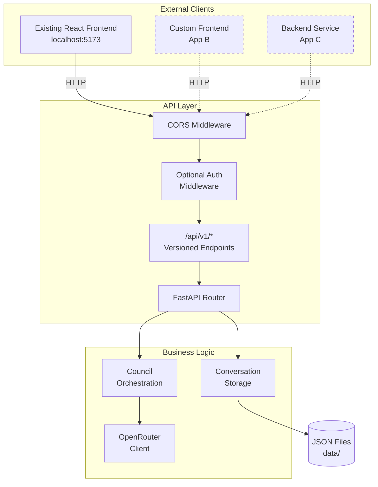
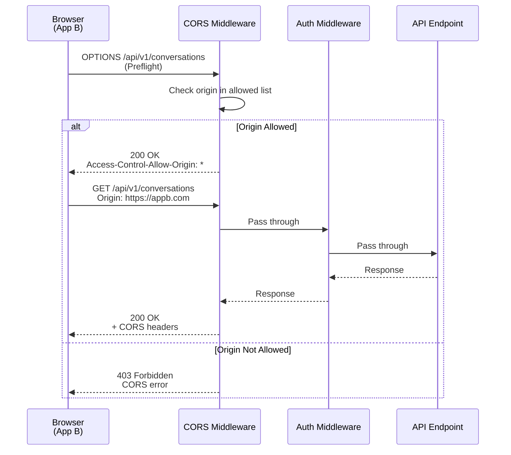
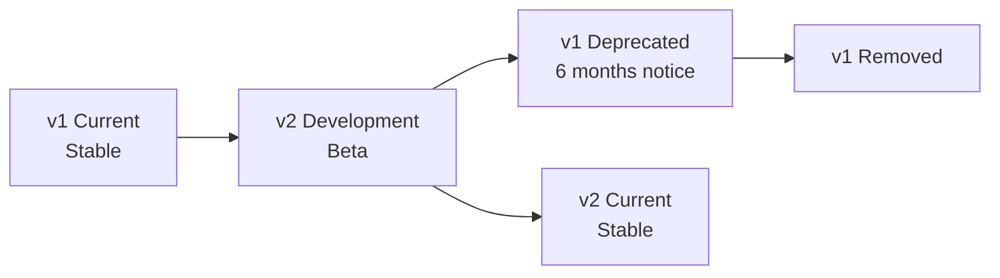

# Technical Specification: LLM Council v1.2 - API-Ready Architecture

**Version:** 1.2  
**Date:** December 24, 2025  
**Status:** Draft  
**Author:** Development Team

---

## Table of Contents

1. [Architecture Overview](#architecture-overview)
2. [API Design](#api-design)
3. [Authentication System](#authentication-system)
4. [CORS Configuration](#cors-configuration)
5. [API Versioning Strategy](#api-versioning-strategy)
6. [Request/Response Formats](#requestresponse-formats)
7. [Error Handling](#error-handling)
8. [Security Considerations](#security-considerations)
9. [Performance Considerations](#performance-considerations)
10. [Migration Strategy](#migration-strategy)

---

## Architecture Overview

### High-Level Architecture



### System Components

| Component | Technology | Purpose | Changes in v1.2 |
|-----------|-----------|---------|-----------------|
| **API Framework** | FastAPI 0.115+ | REST API server | Add versioning, CORS, optional auth |
| **CORS Middleware** | FastAPI CORS | Cross-origin support | Configurable origins |
| **Auth Middleware** | Custom (FastAPI Depends) | API key validation | **NEW** - Optional auth |
| **API Versioning** | URL prefix | Version management | **NEW** - `/api/v1/` prefix |
| **Council Logic** | Python async | LLM orchestration | No changes |
| **Storage** | JSON files | Data persistence | No changes |
| **Frontend** | React + Vite | Web UI | Update API URLs only |

---

## API Design

### API Endpoint Structure

All v1.2 APIs follow this pattern:
```
http://localhost:8001/api/v1/{resource}/{id?}/{action?}
```

### Endpoint Migration

| v1.1 Endpoint | v1.2 Endpoint | Status |
|---------------|---------------|--------|
| `GET /` | `GET /` | Unchanged |
| `GET /health` | `GET /health` | Unchanged |
| `GET /api/conversations` | `GET /api/v1/conversations` | **Versioned** |
| `POST /api/conversations` | `POST /api/v1/conversations` | **Versioned** |
| `GET /api/conversations/{id}` | `GET /api/v1/conversations/{id}` | **Versioned** |
| `POST /api/conversations/{id}/message` | `POST /api/v1/conversations/{id}/message` | **Versioned** |
| `POST /api/conversations/{id}/message/stream` | `POST /api/v1/conversations/{id}/message/stream` | **Versioned** |
| - | `GET /api/v1/status` | **NEW** |
| - | `GET /api/v1/docs` | **NEW** (Swagger UI) |

### Backward Compatibility Aliases

For 6-month deprecation period, old routes redirect to v1:

```python
# Temporary aliases (remove in v1.3)
@app.get("/api/conversations")
async def list_conversations_legacy():
    """Legacy endpoint - use /api/v1/conversations instead."""
    return RedirectResponse(url="/api/v1/conversations", status_code=301)
```

---

## Authentication System

### Design Philosophy

**Optional by Default:**
- Auth disabled by default (backward compatibility)
- If `API_KEYS` not configured → allow all requests
- If `API_KEYS` configured → validate header

**Simple API Key Model:**
- Static keys configured via environment variable
- No dynamic key generation in v1.2
- No user accounts or permissions

### Implementation

**Configuration (.env):**
```bash
# Enable authentication
API_KEYS=key1,key2,key3

# Or disable (default)
# API_KEYS=
```

**Middleware (backend/auth.py):**
```python
from fastapi import Header, HTTPException, Depends
from typing import Optional
import os

def get_api_keys() -> list[str]:
    """Load API keys from environment."""
    keys = os.getenv("API_KEYS", "")
    if not keys:
        return []
    return [k.strip() for k in keys.split(",")]

async def verify_api_key(
    x_api_key: Optional[str] = Header(None)
) -> Optional[str]:
    """
    Validate API key if authentication is enabled.
    
    Returns:
        The validated API key or None if auth disabled
    
    Raises:
        HTTPException: 401 if key invalid
    """
    valid_keys = get_api_keys()
    
    # Auth disabled - allow all requests
    if not valid_keys:
        return None
    
    # Auth enabled but no key provided
    if not x_api_key:
        raise HTTPException(
            status_code=401,
            detail={
                "error": {
                    "code": "MISSING_API_KEY",
                    "message": "API key required. Provide X-API-Key header.",
                }
            }
        )
    
    # Validate key
    if x_api_key not in valid_keys:
        raise HTTPException(
            status_code=401,
            detail={
                "error": {
                    "code": "INVALID_API_KEY",
                    "message": "The provided API key is invalid.",
                }
            }
        )
    
    return x_api_key
```

**Usage in Routes:**
```python
from backend.auth import verify_api_key

@app.get("/api/v1/conversations")
async def list_conversations(
    api_key: Optional[str] = Depends(verify_api_key)
):
    """List conversations. Optional auth."""
    return storage.list_conversations()
```

### Security Considerations

**Current (v1.2):**
- Keys transmitted in clear HTTP (localhost only)
- No key rotation mechanism
- No per-key permissions/rate limits
- Keys in plain text `.env` file

**Future Improvements (v2.0+):**
- HTTPS required in production
- JWT tokens instead of static keys
- OAuth2 authorization code flow
- Per-user/per-app permissions
- Key rotation and revocation

---

## CORS Configuration

### Design Requirements

1. **Development:** Allow `*` (any origin)
2. **Production:** Explicit whitelist only
3. **Configurable:** Via environment variable
4. **Credentials:** Support for future cookie-based auth

### Implementation

**Configuration (.env):**
```bash
# Development (permissive)
API_CORS_ORIGINS=*

# Production (restrictive)
API_CORS_ORIGINS=https://myapp.com,https://app.example.com

# Default (localhost only)
API_CORS_ORIGINS=http://localhost:5173,http://localhost:3000
```

**Middleware (backend/main.py):**
```python
import os
from fastapi.middleware.cors import CORSMiddleware

def get_cors_origins() -> list[str]:
    """Load CORS origins from environment."""
    origins = os.getenv(
        "API_CORS_ORIGINS",
        "http://localhost:5173,http://localhost:3000"
    )
    
    if origins == "*":
        return ["*"]
    
    return [o.strip() for o in origins.split(",")]

app.add_middleware(
    CORSMiddleware,
    allow_origins=get_cors_origins(),
    allow_credentials=True,
    allow_methods=["*"],
    allow_headers=["*"],
    expose_headers=["X-API-Version", "X-Service-Version"],
)
```

### CORS Flow



---

## API Versioning Strategy

### Versioning Approach

**URL-Based Versioning:**
- Format: `/api/v{major}/`
- Examples: `/api/v1/`, `/api/v2/`
- Major version only (no minor in URL)

**Rationale:**
- Simple and explicit
- Easy to understand for external developers
- Supports multiple versions simultaneously
- Follows REST best practices

### Version Lifecycle



**Version States:**
1. **Current:** Actively maintained, recommended
2. **Beta:** Available but not stable
3. **Deprecated:** Supported but removal planned
4. **Removed:** No longer available

### Implementation

**Route Prefixing:**
```python
from fastapi import APIRouter

# v1 router
router_v1 = APIRouter(prefix="/api/v1")

@router_v1.get("/conversations")
async def list_conversations_v1():
    """List conversations (API v1)"""
    return storage.list_conversations()

# Register router
app.include_router(router_v1)
```

**Response Headers:**
```python
from fastapi import Response

@app.middleware("http")
async def add_version_headers(request, call_next):
    """Add version info to all responses."""
    response = await call_next(request)
    response.headers["X-API-Version"] = "v1"
    response.headers["X-Service-Version"] = "1.2.0"
    return response
```

### Breaking Change Policy

**Major Version Change (v1 → v2):**
- URL structure changes
- Request/response format changes
- Removed endpoints
- Authentication requirement changes

**Minor Version Change (v1.2 → v1.3):**
- New optional fields
- New endpoints
- Deprecation warnings
- No breaking changes to existing contracts

**Patch Version Change (v1.2.0 → v1.2.1):**
- Bug fixes only
- No API changes

---

## Request/Response Formats

### Standard Response Envelope

**Success Response:**
```json
{
  "data": {
    // Actual response data
  },
  "meta": {
    "timestamp": "2025-12-24T10:30:00Z",
    "api_version": "v1",
    "service_version": "1.2.0"
  }
}
```

**Note:** For backward compatibility, v1.2 returns data directly (no envelope).  
Envelope may be added in v2.0.

### Example Endpoints

#### GET /api/v1/status

**Request:**
```http
GET /api/v1/status HTTP/1.1
Host: localhost:8001
Accept: application/json
```

**Response:**
```json
{
  "service": "LLM Council API",
  "version": "1.2.0",
  "api_version": "v1",
  "status": "healthy",
  "models": {
    "council": [
      "openai/gpt-5.1",
      "google/gemini-3-pro-preview",
      "anthropic/claude-sonnet-4.5",
      "x-ai/grok-4"
    ],
    "chairman": "google/gemini-3-pro-preview"
  },
  "features": {
    "auth_required": false,
    "streaming": true,
    "versioned_api": true
  }
}
```

#### POST /api/v1/conversations

**Request:**
```http
POST /api/v1/conversations HTTP/1.1
Host: localhost:8001
Content-Type: application/json
X-API-Key: optional-key-here

{}
```

**Response:**
```json
{
  "id": "550e8400-e29b-41d4-a716-446655440000",
  "created_at": "2025-12-24T10:30:00.123Z",
  "title": "New Conversation",
  "messages": []
}
```

#### POST /api/v1/conversations/{id}/message

**Request:**
```http
POST /api/v1/conversations/550e8400-e29b-41d4-a716-446655440000/message HTTP/1.1
Host: localhost:8001
Content-Type: application/json
X-API-Key: optional-key-here

{
  "content": "What is quantum computing?"
}
```

**Response:**
```json
{
  "stage1": [
    {
      "model": "openai/gpt-5.1",
      "response": "Quantum computing is..."
    },
    // ... more models
  ],
  "stage2": [
    {
      "model": "openai/gpt-5.1",
      "ranking": "FINAL RANKING:\n1. Response B\n2. Response A...",
      "parsed_ranking": ["Response B", "Response A", ...]
    },
    // ... more models
  ],
  "stage3": {
    "model": "google/gemini-3-pro-preview",
    "response": "Based on the council's insights..."
  },
  "metadata": {
    "label_to_model": {
      "Response A": "openai/gpt-5.1",
      "Response B": "google/gemini-3-pro-preview"
    },
    "aggregate_rankings": [
      {
        "model": "google/gemini-3-pro-preview",
        "average_rank": 1.25,
        "rankings_count": 4
      }
    ]
  }
}
```

---

## Error Handling

### Error Response Format

**Consistent Schema:**
```json
{
  "error": {
    "code": "ERROR_CODE",
    "message": "Human-readable error message",
    "details": {
      // Optional additional context
    }
  }
}
```

### Error Codes

| HTTP Status | Error Code | Meaning |
|-------------|-----------|---------|
| 400 | `INVALID_REQUEST` | Request validation failed |
| 400 | `INVALID_CONVERSATION_ID` | Conversation ID format invalid |
| 401 | `MISSING_API_KEY` | API key required but not provided |
| 401 | `INVALID_API_KEY` | API key invalid |
| 404 | `CONVERSATION_NOT_FOUND` | Conversation doesn't exist |
| 404 | `ENDPOINT_NOT_FOUND` | API endpoint doesn't exist |
| 500 | `INTERNAL_ERROR` | Server error |
| 503 | `SERVICE_UNAVAILABLE` | Temporarily unavailable |

### Example Error Responses

**Missing API Key:**
```json
{
  "error": {
    "code": "MISSING_API_KEY",
    "message": "API key required. Provide X-API-Key header.",
    "details": {
      "header": "X-API-Key",
      "documentation": "http://localhost:8001/api/v1/docs"
    }
  }
}
```

**Conversation Not Found:**
```json
{
  "error": {
    "code": "CONVERSATION_NOT_FOUND",
    "message": "Conversation with ID '550e8400...' not found",
    "details": {
      "conversation_id": "550e8400-e29b-41d4-a716-446655440000"
    }
  }
}
```

---

## Security Considerations

### Current Security Model (v1.2)

**Threat Model:**
- **Target Environment:** Local development (localhost)
- **Trust Level:** Single user, trusted network
- **Attack Surface:** Minimal (no public exposure)

**Security Measures:**
1. **Optional API Keys:** Simple shared secrets
2. **CORS Protection:** Restrict origins
3. **Read-only .env:** Prevent accidental writes
4. **Input Validation:** FastAPI automatic validation
5. **No SQL Injection:** JSON file storage

### Future Security Enhancements (v2.0+)

**Required for Production:**
- [ ] HTTPS/TLS encryption
- [ ] JWT tokens instead of static keys
- [ ] Per-user authentication (OAuth2)
- [ ] Rate limiting
- [ ] Request signing
- [ ] Audit logging
- [ ] Secret rotation
- [ ] Input sanitization

### Security Checklist

**For v1.2 Release:**
- [x] API keys optional (backward compatible)
- [x] CORS configurable
- [x] Sensitive data not logged
- [x] .env in .gitignore
- [ ] Security audit completed
- [ ] Penetration testing (optional for local dev)

---

## Performance Considerations

### Expected Performance

| Metric | Target | Measurement |
|--------|--------|-------------|
| Auth Overhead | < 5ms | Time to validate API key |
| CORS Overhead | < 1ms | Time to check origin |
| Routing Overhead | < 1ms | Time to route versioned URL |
| Total Overhead | < 10ms | Combined middleware latency |

### Performance Testing

**Benchmark Script:**
```python
import time
import requests

def benchmark_endpoint(url, iterations=100):
    """Benchmark API endpoint."""
    times = []
    for _ in range(iterations):
        start = time.time()
        response = requests.get(url)
        elapsed = (time.time() - start) * 1000  # ms
        times.append(elapsed)
    
    print(f"Mean: {sum(times)/len(times):.2f}ms")
    print(f"P50: {sorted(times)[len(times)//2]:.2f}ms")
    print(f"P95: {sorted(times)[int(len(times)*0.95)]:.2f}ms")
    print(f"P99: {sorted(times)[int(len(times)*0.99)]:.2f}ms")

# Test v1.1 vs v1.2
benchmark_endpoint("http://localhost:8001/api/conversations")  # v1.1
benchmark_endpoint("http://localhost:8001/api/v1/conversations")  # v1.2
```

### Optimization Strategies

**Current (v1.2):**
- Minimal middleware overhead
- No caching (keep simple)
- Synchronous auth check (fast enough)

**Future Optimizations:**
- Response caching for read-heavy endpoints
- Connection pooling for OpenRouter
- Async auth with Redis
- CDN for static OpenAPI docs

---

## Migration Strategy

### Phase 1: Add Versioned Routes (Week 1)

**Changes:**
1. Create `backend/routers/` directory
2. Move endpoints to `backend/routers/api_v1.py`
3. Register router with `/api/v1` prefix
4. Add version headers middleware

**Testing:**
- All new routes return 200
- Response format unchanged
- Old routes still work (backward compat check)

### Phase 2: Update Frontend (Week 1)

**Changes:**
1. Update `frontend/src/api.js`:
   ```javascript
   const API_BASE = 'http://localhost:8001/api/v1';
   ```
2. Test all frontend features
3. Verify no regressions

**Testing:**
- E2E tests pass
- Manual smoke test
- Network tab shows v1 URLs

### Phase 3: Add CORS & Auth (Week 2)

**Changes:**
1. Add CORS middleware configuration
2. Implement optional auth middleware
3. Update `.env.example` with new variables

**Testing:**
- CORS preflight works
- Auth optional by default
- With API_KEYS set, auth required

### Phase 4: Documentation (Week 2)

**Changes:**
1. Create `README_API.md`
2. Add OpenAPI descriptions
3. Add code examples

**Testing:**
- Examples work when copy-pasted
- Swagger UI complete
- External developer can integrate

### Phase 5: Deprecation Notices (Week 3)

**Changes:**
1. Add deprecation warnings to old routes
2. Update response headers
3. Set removal date (6 months)

**Example:**
```python
@app.get("/api/conversations")
async def list_conversations_legacy(response: Response):
    """DEPRECATED: Use /api/v1/conversations instead."""
    response.headers["X-API-Deprecated"] = "true"
    response.headers["X-API-Sunset"] = "2026-06-30"
    response.headers["X-API-Replacement"] = "/api/v1/conversations"
    return RedirectResponse(url="/api/v1/conversations")
```

---

## Appendix

### File Structure Changes

**New Files:**
```
backend/
├── auth.py                    # NEW: Auth middleware
├── routers/                   # NEW: API routers directory
│   ├── __init__.py
│   └── api_v1.py             # NEW: v1 routes
└── middleware/                # NEW: Middleware modules
    ├── __init__.py
    ├── cors.py               # NEW: CORS configuration
    └── versioning.py         # NEW: Version headers
```

**Modified Files:**
```
backend/
└── main.py                    # Modified: Add routers, middleware
```

### Environment Variables Reference

| Variable | Default | Purpose | Required |
|----------|---------|---------|----------|
| `OPENROUTER_API_KEY` | None | OpenRouter API access | Yes |
| `API_KEYS` | Empty | Authentication keys | No |
| `API_CORS_ORIGINS` | `localhost:5173,localhost:3000` | CORS whitelist | No |
| `API_AUTH_ENABLED` | `true` if API_KEYS set | Enable/disable auth | No |

### Related Documents

- [v1.2 PRD](./PRD-v1.2.md) - Product requirements
- [v1.2 Implementation Plan](./ImplementationPlan-v1.2.md) - Step-by-step guide
- [v1.2 Test Plan](./TestPlan-v1.2.md) - Testing strategy
- [v1.1 Technical Spec](../v1.1/TechnicalSpec-v1.1.md) - Previous architecture
- [Product Overview](../../ProductOverview.md) - System-wide documentation
- [Project Conventions](../../ProjectConventions.md) - Development standards

---

**Document Status:** Draft  
**Last Updated:** December 24, 2025  
**Ready for Implementation:** Pending PRD approval

